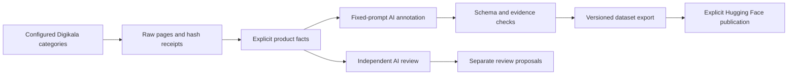

# digikala-dataset

A Python pipeline for collecting Digikala product listings, extracting explicit
facts, annotating supported semantic features with an LLM, and maintaining
versioned datasets. The first dataset covers Persian gold-product listings:
jewelry, coins, bars, and melted gold.

**Dataset:** [Digikala Gold Products (Persian) on Hugging Face](https://huggingface.co/datasets/amupouya/digikala-gold-products-fa)

> Gold refers to the product domain; annotations are AI-generated and
> coordinator-reviewed, not a fully human-labeled gold standard.

This project and its initial dataset were developed through an iterative,
OpenAI-assisted workflow: collection, deterministic normalization, parallel
annotation sessions, independent AI review, and coordinator corrections.
The historical labels came from interactive sessions. Exact teacher model
versions were not recorded, so unknown versions remain null. AI review is
recorded as AI review; it is not represented as human verification.

The current code turns that workflow into configurable API-driven stages.
It supports providers available through LiteLLM, with a model name, API key
environment variable, and optional endpoint. It is not guaranteed to reproduce
the historical labels exactly. Fine-tuning and model serving are outside scope.

## Published dataset

The frozen reference is **v2.1**, containing **7,763 products** at revision
[`ac32109d617722eea34c1ff69f5d0b086afe82fc`](https://huggingface.co/datasets/amupouya/digikala-gold-products-fa/tree/ac32109d617722eea34c1ff69f5d0b086afe82fc).
See the [dataset card](https://huggingface.co/datasets/amupouya/digikala-gold-products-fa/blob/ac32109d617722eea34c1ff69f5d0b086afe82fc/README.md)
for the published fields, annotation history, quality reports, and source-data terms.

| Published partition | Products | Purpose |
| --- | ---: | --- |
| `train_candidates` | 1,553 | Original candidate pool |
| `evaluation` | 600 | Frozen AI-reviewed reference |
| `reserved_context` | 5,610 | Original contextual and family reservations |

Each product combines source facts, evidence-backed semantic labels, annotation
provenance, and release membership. Prices use **Iranian rials (`IRR`)**.

Semantic annotations cover:

| Field | Meaning |
| --- | --- |
| `taxonomy` | Canonical product type, separate from marketplace category IDs |
| `audience` | Supported wearer audience |
| `styles` | Explicitly supported style descriptors |
| `motifs` | Motif family and concept |
| `use_cases` | Supported uses such as daily wear, gifts, or investment |
| `design_details` | Features such as chain pattern, form, finish, or decoration |
| `abstentions` | Reasons a field remains unknown or unsupported |
| `vocabulary_gaps` | Source concepts absent from the controlled vocabulary |

Predictions include source quotes and subjective confidence. The confidence
values are not calibrated probabilities. Passing schema and quote checks does
not establish semantic correctness.

After installing this project, load the published evaluation with Hugging Face:

```python
from datasets import load_dataset

evaluation = load_dataset(
    "amupouya/digikala-gold-products-fa",
    revision="ac32109d617722eea34c1ff69f5d0b086afe82fc",
    split="evaluation",
)
```

## Pipeline



1. **Collect:** fetch configured pages with bounded concurrency, access-policy
   checks, and checkpoints. Requests stop on access or rate-limit errors.
2. **Normalize:** parse IDs, titles, prices, availability, selected attributes,
   and image URLs. Deduplicate by product ID while retaining page observations.
3. **Annotate:** send source fields, a shared policy, and one task prompt to a
   configured model. Existing labels are excluded from the input.
4. **Validate:** require the correct record ID, response schema, abstention
   consistency, and quotes present in allowed source fields.
5. **Review:** run a source-only review independently and retain its proposals
   separately. Review results cannot overwrite dataset labels through export.
6. **Export:** require a complete successful annotation run and retain source
   records, prompt hashes, available model metadata, and null human review.
7. **Maintain:** audit reservations and create family-based splits against a
   frozen reference, without rewriting evaluation labels.

Successful annotations resume only when source, prompt, and model settings
match. Failed items remain visible and make the label/review command exit with
a nonzero status. A later explicit rerun retries failed items. Export refuses
incomplete results and existing output files.

## Quick start

Requires Python **3.11+**. The current offline checks were run with Python 3.13.
No GPU is required for API-based annotation.

```bash
git clone https://github.com/stupidprogrammer4/digikala-dataset.git
cd digikala-dataset
python -m venv .venv
source .venv/bin/activate
python -m pip install -e .
cp config.toml.sample config.toml
digikala-dataset --help
```

For model annotation, also install the optional provider SDK:

```bash
python -m pip install -e '.[labeling]'
```

Edit `config.toml` before a live run:

- `[crawl]`: endpoint, category IDs, output folder, page limit, concurrency,
  delay, and timeout. The sample includes the historical eight category IDs.
  `pages_per_category = 0` follows all pages reported by the API.
- `[annotation]`: LiteLLM provider-qualified model, credential environment
  variable, optional `api_base`, concurrency, timeout, and token limit.
  Enable `json_mode` only if the chosen provider/model supports it.
- `[hub]`: dataset repository, pinned revision, and local download directory.

`config.toml` is local and ignored. Only `config.toml.sample` belongs in Git.
Set credentials in the environment named by `api_key_env` (by default
`LLM_API_KEY`). `.env.example` documents the variable names; `.env` files are
not loaded automatically. `HF_TOKEN` is used by the Hugging Face SDK when needed.
Run commands from the repository root; paths are relative to the working directory.

## Commands

Start with a small page limit in your local configuration when checking access.
Live collection depends on the source API remaining available and compatible.
Use only authorized access; the collector respects robots.txt and stops on
HTTP 401, 403, or 429 rather than retrying around restrictions.

```bash
# Collect and normalize. Adjust paths if you changed crawl.output.
digikala-dataset crawl
digikala-dataset normalize artifacts/crawl/gold-v1/manifest.json artifacts/products.jsonl

# Set your model and credentials before these commands.
digikala-dataset label artifacts/products.jsonl artifacts/label-run-v1
digikala-dataset review artifacts/products.jsonl artifacts/review-run-v1
digikala-dataset export artifacts/products.jsonl artifacts/label-run-v1 artifacts/export/dataset.jsonl

# Download the published dataset at the configured revision.
digikala-dataset download

# Publish an explicitly selected folder to a new branch of an existing dataset repo.
digikala-dataset publish artifacts/export --repo-id YOUR_ACCOUNT/YOUR_DATASET --revision release-new
```

The publish command creates a new branch, refusing `main`, `master`, and existing
branches. It uploads the selected folder; prepare its dataset card and metadata
before publishing. Labeling and export never publish automatically.

For a different local configuration, place the global option before the command:

```bash
digikala-dataset --config path/to/local-config.toml crawl
```

## Frozen release maintenance

The later local reservation audit released **4,464 snapshot-only exclusions**
back into the candidate pool. A shared listing page alone does not make two
products members of the same family. Identity and evaluation-family exclusions
remain protected. The resulting 6,017 candidates were split by detected family:

| Local maintenance partition | Products |
| --- | ---: |
| `train` | 4,803 |
| `validation` | 1,214 |
| `evaluation` | 600 |
| `reserved_context` | 1,146 |

These are **local maintenance results**, distinct from the published v2.1
partitions above. They have not been published to the linked Hugging Face
revision. The evaluation export is byte-identical to the frozen reference.
The grouping uses existing family IDs, product identities, normalized titles,
numeric title variants, and shared image paths with NetworkX. Hugging Face
Datasets splits sorted family IDs with seed 42; this is not category stratification.

Metadata and original-file hashes are in [releases/](releases/), including the
[freeze reference](releases/v2.1.freeze.toml),
[pool report](releases/v2.1-pool-v1/manifest.toml),
[split report](releases/v2.1-family-split-v1/manifest.toml), and
[artifact index](releases/artifacts.toml).

```bash
digikala-dataset audit-pool
digikala-dataset split
```

These two commands require the historical frozen snapshot under
`artifacts/frozen/v2.1/`. Restore it from a trusted archive and verify it against
the freeze metadata first. The public Hub download alone does not reconstruct
the historical combined export required by these commands. Pool and split
metadata outputs use `artifacts/releases/`; data exports use `artifacts/splits/`.
Existing output directories are never overwritten. Newly collected products
are not automatically assigned this historical release's split policy.

## Project structure

```text
src/
  services/       Small classes coordinating collection, annotation and maintenance
  infra/          HTTP/model/Hub clients, stores, settings and response contracts
  schemas/        Standard-library dataclasses for application records
  tools/          Pure transformations, family policies and versioned prompts
  presentation/   CLI and concrete dependency wiring
tests/            Offline tests and synthetic Python examples
releases/         TOML release metadata and artifact hashes
config.toml.sample
pyproject.toml
```

Infrastructure uses HTTPX, Hugging Face Hub, NetworkX, Datasets, jsonschema, and
the optional LiteLLM SDK directly. The model-response schema is stored in TOML
and validated with jsonschema. Application-owned records use dataclasses.

Git and package resources contain **no JSON or JSONL files**. Runtime API data,
checkpoints, and exported datasets still use JSON/JSONL under ignored paths.
The original files are retained locally with their original hashes; changing
the repository format does not change the frozen dataset. Local settings,
credentials, dataset payloads, model artifacts, and internal working notes
are excluded from Git.

Active prompts are in [src/tools/prompts/](src/tools/prompts/). Each request uses
only the shared policy, one task prompt, and product evidence. Historical
instructions remain separately identified, and their original hashes are
recorded. Synthetic examples belong to the tests and are not added to model context.

## Verification and limitations

```bash
python -m unittest discover -s tests -v
python -m pip check
```

The 26 offline tests cover collection/resume, access restrictions, normalization,
response identity and evidence, annotation resume/export, file-write failures,
Hub revision handling, reservation policy, and family separation. They run from
a clean copy against an installed wheel without private/local data. The frozen
maintenance outputs have also been replayed and compared byte-for-byte locally.

The refactored live crawler and provider integrations have not been validated
against live collection/model calls. Tests use synthetic marketplace envelopes
and mocked provider responses. The archived original raw pages were unavailable
during this refactor, so a historical raw-to-label replay is not claimed.

Dataset limitations include first-page/ranking sampling bias, sparse positive
style/use-case labels, severe class imbalance, uncalibrated confidence, unknown
teacher revisions, and possible undetected near-duplicates. Family checks protect
detected relationships, not every possible product variant. The local family
split has no set/half-set examples in train or validation. AI-reviewed evaluation
measures agreement with that reference, not independently verified human accuracy.

## License and attribution

The software and accompanying original project documentation are licensed under
the [MIT License](LICENSE). This license does not grant rights to Digikala product
texts, images, trademarks, or other third-party source data. The dataset has its
own [dataset card and source-data terms](https://huggingface.co/datasets/amupouya/digikala-gold-products-fa);
its source-data redistribution permission remains unresolved in the frozen card.

Maintained by [stupidprogrammer4](https://github.com/stupidprogrammer4), with
OpenAI-assisted development and annotation. When referencing the dataset, include
its Hugging Face repository ID and exact revision; when referencing this pipeline,
include the Git commit and relevant prompt/schema versions.
